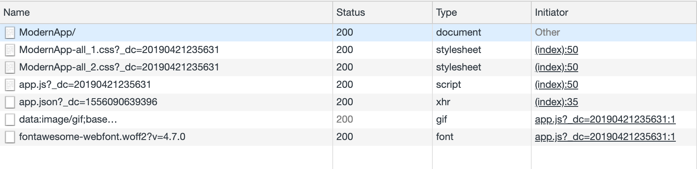
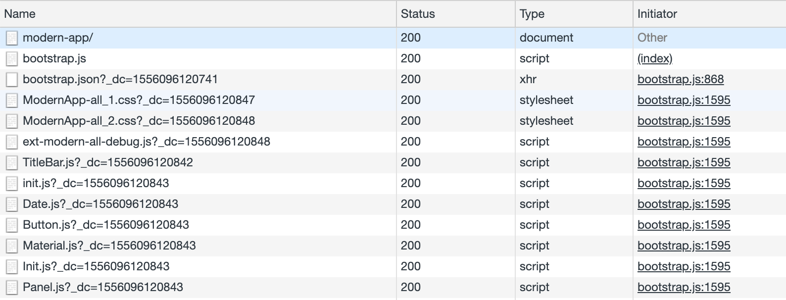
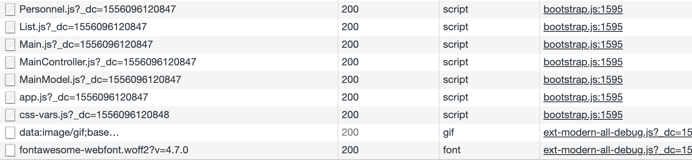
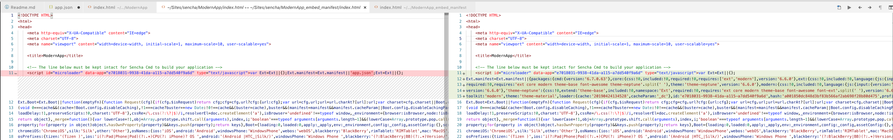
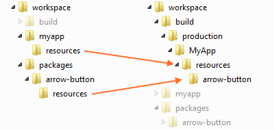
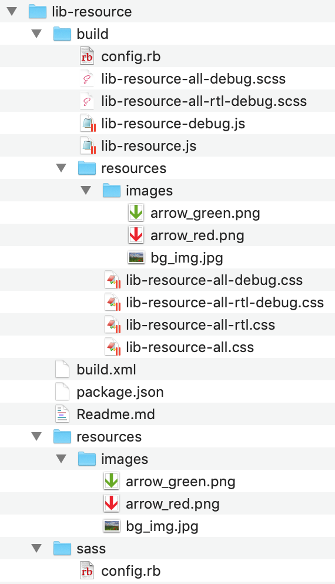

# Create an empty workspace, apps and packages

1. Check the sdk by listing the paths:
> `sencha config --prop sencha.sdk.path --list`

2. Create a workspace in a folder named `empty_ws`:
> `sencha generate workspace empty_ws`

3. Within the root folder of your workspace, execute the following to add the new framework. This creates a folder named `ext` under the `skds` folder in the workspace with a key name `ext`.
> `sencha framework add -key ext -source /Users/ipek/Documents/workspace/sencha/sdks/ext -path sdks/ext` 
  
4. Once you have a Workspace, generating apps can be done as before but using the `"ext" folder` in the workspace:
> `sencha -sdk ./sdks/ext generate app UniversalApp universal-app`

OR

> `sencha -sdk ./sdks/ext generate app --universal UniversalApp universal-app`

   1. By default, this application will be a Universal Application.
   2. `universal-app` will be the `folder name`.
   3. `UniversalApp` will be the `app name` and `app namespace`.
   4. The generated app is built immediately.

4.1. Alternatively, the `--ext` switch can be used to pick the "ext" framework from the workspace without worrying about its path:
> `sencha generate app -ext --classic ClassicApp classic-app`

> `sencha generate app -ext --modern ModernApp modern-app`

1. Add a new package
> `sencha generate package core`

With this command a local package named `core` is created under the *packages\local\core*.

# Building the app
Internally, the `sencha app build` command does basic validation and calls in to the Apache Ant build script found in `"build.xml"` at the root of the application. Specifically, it calls the `"build" target` of this script. This means the entire build process can be examined, extended and (if necessary) even modified.

Most aspects of the build script behind `sencha app build` are controlled by properties as is typical of Ant. 
In this case there are two kinds of properties: `configuration properties` and `build properties`.

## Configuration Properties
**Sencha Cmd configuration properties** are available to the build script but also drive many other features of Sencha Cmd (like the compiler). 

To see the current set of configuration properties, run this command:
> `sencha diag show`
```
[INF]                     buildenvironment.dir : /Users/ipek/Documents/workspace/sencha/empty_ws   
[INF]                buildenvironment.load.dir : /Users/ipek/Documents/workspace/sencha/empty_ws   
[INF]                           cmd.config.dir : /Users/ipek/bin/Sencha/Cmd/6.7.0.63               
[INF]                                  cmd.dir : /Users/ipek/bin/Sencha/Cmd/6.7.0.63               
[INF]               cmd.merge.tool.args.araxis : -wait -merge -3 -a1 {base} {user} {generated} {out}
[INF]               cmd.merge.tool.args.kdiff3 : {base} {user} {generated} -o {out}                
[INF]              cmd.merge.tool.args.p4merge : {base} {user} {generated} {out}                   
[INF]            cmd.merge.tool.args.smartsync : {user} {generated} {base}                         
[INF]           cmd.merge.tool.args.sourcegear : --merge --result={out} {user} {base} {generated}  
[INF]             cmd.merge.tool.args.tortoise : -base:{base} -theirs:{generated} -mine:{user} -merged:{out}
[INF]                               cmd.minver : 3.0.0.0                                           
[INF]                             cmd.platform : osx                                               
[INF]                      cmd.unicode.escapes : /Users/ipek/bin/Sencha/Cmd/6.7.0.63/unicode-escapes.json
[INF]                              cmd.version : 6.7.0.63                                          
[INF]                             cmd.web.port : 1841                                              
[INF]                        inspector.address : http://localhost:1839/                            
[INF]                           repo.local.dir : /Users/ipek/bin/Sencha/Cmd/repo                   
[INF]                          sencha.sdk.path : /Users/ipek/Documents/workspace/sencha/sdks       
[INF]                        shared.sencha.dir : true                                              
[INF]         system.java.net.useSystemProxies : true                                              
[INF]                           workspace.apps : universal-app,classic-app,modern-app              
[INF]                         workspace.apps.0 : universal-app                                     
[INF]                         workspace.apps.1 : classic-app                                       
[INF]                         workspace.apps.2 : modern-app                                        
[INF]                    workspace.apps.length : 3                                                 
[INF]                      workspace.build.dir : /Users/ipek/Documents/workspace/sencha/empty_ws/build
[INF]                     workspace.config.dir : /Users/ipek/bin/Sencha/Cmd/6.7.0.63/ant/build/workspace
[INF]                            workspace.dir : /Users/ipek/Documents/workspace/sencha/empty_ws   
[INF]            workspace.frameworks.ext.path : /Users/ipek/Documents/workspace/sencha/empty_ws/sdks/ext
[INF]         workspace.frameworks.ext.version : 6.7.0.161                                         
[INF]                   workspace.packages.dir : /Users/ipek/Documents/workspace/sencha/empty_ws/packages/local,/Users/ipek/Documents/workspace/sencha/empty_ws/packages                                      
[INF]               workspace.packages.extract : /Users/ipek/Documents/workspace/sencha/empty_ws/packages/remote
```

## Build Properties
`The build script` defines many other properties that are specific to builds. These build properties are typically prefixed by "build.".

To see the current values of these you can run this command from your app folder:
> `cd modern-app/`

> `sencha ant .props`

```
[INF] [echoproperties] #Ant properties   
[INF] [echoproperties] #Tue Apr 16 10:16:46 EEST 2019  
.......   
[INF] [echoproperties] app.dir=/Users/ipek/Documents/workspace/sencha/empty_ws/modern-app   
[INF] [echoproperties] app.environment=production   
.......   
[INF] [echoproperties] app.loader.cache=false   
[INF] [echoproperties] app.loader.cacheParam=_dc   
[INF] [echoproperties] app.manifest.bootstrap=bootstrap.json   
[INF] [echoproperties] app.manifest.name=app.json
[INF] [echoproperties] app.microloader=/Users/ipek/bin/Sencha/Cmd/6.7.0.63/ant/build/app/Microloader.js   
[INF] [echoproperties] app.microloader.bootstrap=/Users/ipek/bin/Sencha/Cmd/6.7.0.63/ant/build/app/Microloader.js   
[INF] [echoproperties] app.microloader.development=development.js   
[INF] [echoproperties] app.microloader.dir=/Users/ipek/bin/Sencha/Cmd/6.7.0.63/ant/build/app   
[INF] [echoproperties] app.microloader.name=Microloader.js   
[INF] [echoproperties] app.microloader.path=/Users/ipek/bin/Sencha/Cmd/6.7.0.63/ant/build/app/Microloader.js   
.......   
[INF] [echoproperties] app.production.cache.enable=true   
[INF] [echoproperties] app.production.compressor.type=yui   
[INF] [echoproperties] app.production.loader.cache=$'{'build.timestamp'}'   
[INF] [echoproperties] app.production.output.appCache.enable=true   
[INF] [echoproperties] app.production.output.appCache.path=cache.appcache   
[INF] [echoproperties] app.resources.dir=/Users/ipek/Documents/workspace/sencha/empty_ws/modern-app/resources   
.......   
[INF] [echoproperties] app.toolkit=modern   
[INF] [echoproperties] app.version=1.0.0.0   
.......   
```

### Setting Build Properties
There are many ways to *configure build properties*. The simplest way is to edit one of the build properties files. To decide which file to edit it is helpful to know the priority of each of these files and under what conditions they are loaded.

- `"local.properties"` -- If present, this file is loaded first. This file is intended to be applied only locally (to the local machine). It should not be committed to source control to be used by others. These settings take priority over any properties defined in other properties files as well as the current configuration properties.

- Sencha Cmd configuration properties

- `".sencha/app/${build.environment}.properties"`
  ".sencha/app/native.properties"
  ".sencha/app/package.properties"
  ".sencha/app/production.properties"
  ".sencha/app/testing.properties"

- `".sencha/app/build.properties"`    
    - => ⁨Users⁩/ipek⁩/bin⁩/Sencha⁩/Cmd⁩/6.7.0.63⁩/ant⁩/build⁩/app⁩/build.properties
- `".sencha/app/defaults.properties"`
    - => Users⁩/ipek⁩/bin⁩/Sencha⁩/Cmd⁩/6.7.0.63⁩/ant⁩/build⁩/app⁩/defaults.properties

# Building a package

Go to the package directory and run:
> `sencha package build`

1. If a package is empty (does not have any toolkit, theme, or `ext` framework dependency) build will succeed.
```
kmac:utils ipek$ sencha package build
Sencha Cmd v6.7.0.63
[INF] Processing Build Descriptor : default
[INF] Loading compiler context
[INF] Processing data with ClosureCompressor
[INF] JavaScript input level is NEXT and output level is ES5
[INF] Writing concatenated output to file /Users/ipek/Documents/workspace/sencha/empty_ws/packages/local/utils/build/utils-debug.js
[INF] Processing data with CmdJavascriptCompressor
[INF] JavaScript input level is NEXT and output level is ES5
[INF] Writing concatenated output to file /Users/ipek/Documents/workspace/sencha/empty_ws/packages/local/utils/build/utils.js
[INF] merging 1 input resources into /Users/ipek/Documents/workspace/sencha/empty_ws/packages/local/utils/build/resources
[INF] merged 1 resources into /Users/ipek/Documents/workspace/sencha/empty_ws/packages/local/utils/build/resources
[INF] merging 0 input resources into /Users/ipek/Documents/workspace/sencha/empty_ws/packages/local/utils/build
[INF] merged 0 resources into /Users/ipek/Documents/workspace/sencha/empty_ws/packages/local/utils/build
[INF] Processing examples in "/Users/ipek/Documents/workspace/sencha/empty_ws/packages/local/utils/examples" (/Users/ipek/Documents/workspace/sencha/empty_ws/packages/local/utils/examples)
```

1. If a package is not empty  but does not have any toolkit, theme dependency we have to make following changes:
   1. Remove sass folder
   2. Modify package.json:
      - Add "framework": "ext"
      - Set "slicer": null
      - Set "sass" : null
      - Add to `ext` and `core` to the requires array:
          "requires": [
            "ext",
            "core"
          ]

3. If not, following changes needed to be made in the `package.json` before building a package independently:
```json
{
    "name": "@<corporation>/<PACKAGE_NAME>",
    "version": "2.0.0.0",
    "sencha": {
        "name": "<PACKAGE_NAME>",
        "namespace": "<YOUR_NAMESPACE>",
        "type": "code",
        "alternateName": [
            "<IF_IT_IS_ALTERNATE_NAME>"
        ],
        "framework": "ext", //Must match with ext name in your workspace
        "toolkit": "classic", //WITHOUT THIS EXT MODULE IS MISSING
        "theme": "theme-triton", // MANDATORY WITHOUT THIS CORE MODULE NOT COMPILE
        "requires": [
            "ext",
            "core",
            "ux"
        ],
        "creator": "<YOUR NAME>",
        "summary": "<YOUR SUMMARY>",
        "detailedDescription": "<YOUR SUMMARY>",
        "version": "6.5.0", 
        "compatVersion": "6.5.0",
        "format": "1",
        "sass": {
            "namespace": "<YOUR_NAMESPACE>",
            "etc": [
                "${package.dir}/sass/etc/all.scss",
                "${package.dir}/${toolkit.name}/sass/etc/all.scss"
            ],
            "var": [
                "${package.dir}/sass/var",
                "${package.dir}/${toolkit.name}/sass/var"
            ],
            "src": [
                "${package.dir}/sass/src",
                "${package.dir}/${toolkit.name}/sass/src"
            ]
        },
        "output": {
            "base": "${package.dir}/build",
            "js": "..",
            "sass": ""
        },
        "local": true,
        "classpath": [
            "${package.dir}/src",
            "${package.dir}/${toolkit.name}/src"
        ],
        "overrides": [
            "${package.dir}/overrides",
            "${package.dir}/${toolkit.name}/overrides"
        ],
        "slicer": {
            "js": [
                {
                    "path": "${package.dir}/sass/example/custom.js",
                    "isWidgetManifest": true
                }
            ]
        }
    }
}
```

# Changing the place of generated files for develeopment (move them under the folder named 'generatedFiles')

- In app.json, make the following changes:
```json
    "bootstrap": {
        "base": "${app.dir}",
        
        "manifest": "generatedFiles/bootstrap.json",
        "microloader": "generatedFiles/bootstrap.js",
        "css": "generatedFiles/bootstrap.css"
    },
```
Do not make the same changes for the `"output"` entry which affects the **production** build.

- In index.html, add *generatedFiles* path to access the new location of generated bootstrap.js:
```html
<script id="microloader" data-app="e7018031-9938-41da-a115-a7dd540f9a6d" type="text/javascript" src="generatedFiles/bootstrap.js"></script> 
```
# Move production builds to our local Sites folder:

- Change/Add the **"base"** entry as the following:

```json
    /**
     * Settings specific to production builds.
     */
    "production": {
        "output": {
            "base": "/Users/ipek/Sites/sencha/${app.name}",
            "appCache": {
                "enable": false,
                "path": "cache.appcache"
            }
```

# Application Folder structures

## Cmd Apps

### Classic/Modern
    /${app.name}  
      /app  
        /model
        /store
        /view
        Application.js
        Application.scss
      
      /resources

    app.js
    app.json

### Universal
    /${app.name}  
      /app  
        /model
        /store
        /view
        Application.js
        Application.scss
      
      /resources

      /classic
        /resources
        /src

      /modern
        /resources
        /src

    app.js
    app.json

## Open Tooling Apps

Open tooling apps, even though they have one build profile, they have this profile defined in the `builds` configuration of `app.json`.

It seems like, even though an app is generated as having a one toolkit or one platform, it is structurally more ready to be extended to add another toolkit/platform.

### Classic/Modern
    /${app.name}
      /app
        /desktop
          /src
            /model
            /store
            /view
            /util
            Application.js
            Application.scss

          /sass
            src.scss
            var.scss
          
          /overrides

        /shared
          /src
            /model
            /store
            /view
            /util

          /sass
            src.scss
            var.scss
          
          /overrides
      
      /resources

    app.js
    app.json

### Universal
    /${app.name}
      /app
        /desktop
          /src
            /model
            /store
            /view
            /util
            Application.js
            Application.scss

          /sass
            src.scss
            var.scss
          
          /overrides

        /phone
          /src
            /model
            /store
            /view
            /util
            Application.js
            Application.scss

          /sass
            src.scss
            var.scss
          
          /overrides

        /shared
          /src
            /model
            /store
            /view
            /util

          /sass
            src.scss
            var.scss

          /overrides
      
      /resources
        /desktop
        /phone
        /shared

    app.js
    app.json

# Inner Workings of Sencha Cmd

## Microloader

Dynamic loader for JS and CSS

### The Manifest
- `app.json`: Sencha Cmd transforms the content of `app.json` and passes on the resulting manifest to the Microloader to use at runtime. Lastly, Ext JS itself also consults the runtime manifest for configuration options.

- `Ext.manifest`
When you launch your application, you will find the **processed content of "app.json"** loaded as `Ext.manifest`.

- The `script` Tag
To use the Microloader, your page will need to contain the following `script` tag:
```html
<script id="microloader" data-app="12345" type="text/javascript" src="bootstrap.js"></script>
```
By default, this `script` tag **will be replaced** by the build process but is used **during development** to load the application. 
The **data-app** atrribute should have been generated for you during app scaffold. This is a unique ID used in local storage to prevent data collision.

#### `app.json` Defaults and Customization

#### indexHtmlPath
This is the path to the application's HTML document (relative to the "app.json" file). By default this property is set to "index.html". If you server uses PHP, ASP, JSP or other technology, you can change this value to point at the proper file like so:
  `indexHtmlPath": "../page.jsp`

If you change this setting, you will likely also need to change your "output" options (see below).

#### `js`
An array of **descriptions of JavaScript code files to load**. By default, an Ext JS 6 application will have something like this:
```json
"js": [{
    "path": "app.js",
    "bundle": true
}]
```

This entry specifies your application's **entry point**. The `bundle` flag indicates that when you run `sencha app build`, this entry should be replaced by **the concatenated output of the build**. You can add other files to this array like so:
```json
"js": [{
    "path": "library1.js"
    // "remote": false (defaults)
},{
    "path": "library2.js",
    "remote": true
},{
    "path": "library3.js",
    "includeInBundle": true
},{
    "path": "app.js",
    "bundle": true
}]
```
- `"library1.js"` would be assumed to **reside in your app folder** and **would then be copied to the build output folder**. The entry would remain in the manifest and be **loaded separately by the Microloader**.

- To simply pass along the entry for the Microloader to load (and **not be copied** by the build process), add the "remote" property like for `"library2.js"`:

- `"library3.js"` will be included in **the concatenated build output** and *removed from the runtime manifest*.

**Note:** While you can add entries to this array, most dependencies will appear in `"requires"` statements in your code or in `requires` array in "app.json"  

- "path": "path/to/script.js"  
Path to file. If the file is local this must be a relative path from this app.json file.

- "bundle": false  
Set to true on one file to indicate that it should become the container for the concatenated classes.

- "includeInBundle": false  
Set to true to include this file in the concatenated classes.

- "remote": false  
Specify as true if this file is remote and should not be copied into the build folder. Defaults to false for a local file which will be copied.

- "bootstrap": false  
A value of true indicates that is a **development mode only** dependency.  
These files will not be copied into the build directory or referenced in the generate app.json manifest for the microloader.

- "update": ""  
If not specified, this file will only be loaded once, and cached inside `localStorage` until this value is changed. You can specify:  
    - "delta" to enable over-the-air delta update for this file
    - "full" means full update will be made when this file changes

**Examples:**
- Cmd Classic/Modern
```json
"classpath": [
    "app"
],
```
- Cmd Universal  
```json
"classpath": [
    "app",
    "${toolkit.name}/src" // To include /classic/src
],
```

#### `css`
Your CSS assets are handled slightly different than JavaScript. This is because in a stock Sencha Cmd application, **CSS is compiled from the `.scss` source**. The initial content of the "css" property looks something like this:
```json
"css": [{
    "path": "boostrap.css",
    "bootstrap": true
}],
```
- This CSS file is a simple stub that **imports a build** of your `"sass"` folder.
- The `"bootstrap"` flag indicates that the entry is used **for development** but **should be removed from build output**. 
- For a build, the **compiled CSS** file will be appended to the `"css" array` of the generated manifest.

- In an empty app, "bootstrap.css" imports the theme from the framework and looks something like this:
`@import "..../ext-theme-neptune/build/ext-theme-neptune-all.css";`

- As you *build your app*, this file is updated to point at the **most recently built CSS file**. For example if you run `sencha app build`, the **production CSS file** will be *imported by "bootstrap.css"* like so:  
`@import "..../build/..../app-all.css";`

**My Note:**
This doesn't seem true: production build has nothing to do with the update of *bootstrap.css*. Instead **development build** updates the *bootstrap.css*:  
`@import '../build/development/ModernApp/resources/ModernApp-all.css';`

- The "css" entries also support the `remote` property. When **remote is NOT set** they operate in the same way as "js" entries in that they are **copied to the build output folder**.

#### output
The "output" object gives you the ability to control where and how build outputs are generated. This object can control many aspects of the build output. In our use of indexHtmlPath above, we told Sencha Cmd that the source for the page was "../page.jsp". To complete this process, we use output to tell Sencha Cmd where the built page will reside relative to the built JavaScript and CSS. To maintain the same relative arrangement as in the source tree, we would add this to "app.json":
```json
"output": {
    "page": {
        "path": "../page.jsp",
        "enable": false
    },
    appCache: {
        "enable": false
    },
    "manifest": {
        "name": "bootstrap.js"
    }
}
```
In this case, we've also added "enable" and set it to false. This combination tells Sencha Cmd *where the final page will be but also **not to generate it by copying the source** (as specified by "indexHtmlPage").

Since we are not generating the page, the Microloader script tag will contain the same "src" value of "bootstrap.js". The "manifest" option above instructs Sencha Cmd to generate the built Microloader using the same name. This is a common need for server-side template environments like JSP or ASP, but also others.

#### Application Cache (`appCache`)

The *Application cache* is **a manifest** used to determine **what assets the browser should store for offline access**. To enable this simply toggle the `enable` flag for the `appCache` property inside your output object. For example:
```json
"output": {
    "page": "index.html",
    "appCache": {
        "enable": true
    }
}
```
The `appCache` property seen here is used to determine if the build process will generate an Application Cache Manifest file. If this is set to *true* the manifest will be generated from the **top level** appCache config object in your app.json. It will look something like this:

```json
"appCache": {
    "cache": [
        "index.html"
    ],
    "network": [
        "*"
    ],
    "fallback": []
}
```
#### Local Storage Cache

The Local Storage Caching system is a seperate **offline caching system** from the browsers built in Application Cache.
- Assets are stored in Local Storage via *unique keys* and during bootstrap these assets will be requested first before attempting any remote loading. 
- This allows for applications to be loaded very fast and without an internet connection. 
- This cache also allows for **delta patching** of assets which means that only the changed bits of your assets, css or js, will be loaded over the network. The file will then be **patched in local storage** and delievered to the user.

This cache is enabled per asset via the `update` propety. This can be set to either `"full"` or `"delta"`. Below is an example of JS and CSS assets both with Local Storage Caching enabled.

```json
// app.js will be delta patched on updates
"js": [
    {
        "path": "app.js",
        "bundle": true,
        "update": "delta"
    }
],
// app.css will be fully downloaded on updates
"css": [
    {
        "path": "app.css",
        "update": "full"
    }
]
```

Once *Local Storage Caching* has been **enabled on an asset** one must **_globally_ enable** the cache config `"app.json"`. 
- Normally during *development builds* one will want this set to *false* and in *production builds* this would be set to *true*.
```json
"cache": {
    "enable": false
}
```

One can also configure the path and generation of **deltas**. When the deltas property is set to a *truthy* value all assets using Local Storage Caching will have deltas generated into the builds `"deltas"` folder. If deltas is set to a string, the value will be used as the **folder name** that all patch files will be saved into. The `delta` toggle will have no effect if `enable` is set to *false*.

"cache": {
    "enable": true,
    "deltas": true
}

- Both **Application Cache** and **Local Storage Cache** will **instantly load files for _offline access_**. Because of this **updated files will NOT be loaded into the users current application experience**. 

- Once the Microloader has detected and loaded new Application Cache or Local Storage files, it will **dispatch a global event** allowing you to prompt the user to reload the application for the latest updates. You can listen for this event by adding the following code to your application:

```js
Ext.application({
    name: 'MyApp',
    mainView: 'MyMainView',
    onAppUpdate: function () {
      Ext.Msg.confirm('Application Update', 'This application has an update, reload?',
          function (choice) {
              if (choice === 'yes') {
                  window.location.reload();
              }
          }
    );
}
```

#### Build Profiles
When an application has *multiple variations*, we can add a `“builds”` object to "app.json" to describe the desired builds like this (taken from Kitchen Sink):
```json
"builds": {
    "classic": {
        "theme": "ext-theme-classic"
    },
    "gray": {
        "theme": "ext-theme-gray"
    },
    "access": {
        "theme": "ext-theme-access"
    },
    "crisp": {
        "theme": "ext-theme-crisp"
    },
    "neptune": {
        "theme": "ext-theme-neptune"
    }
}
```
_Each key_ in “builds” is called a **"build profile"**. The value is a set of property overrides that are applied to the base content of "app.json" to produce the output manifest as described below. In this case, the `“theme”` property is all that is being modified for each build profile.

There are **two optional properties** that are common variations for application builds: `“locales”` and `“themes”`. These are used to automate the process of producing the final build profiles. For example, Kitchen Sink uses “locales”:
```json
"locales": [
    "en",
    "he"
],
```

When `“locales”` or `“themes”` are given, **each of the values are combined with each of the entries** in “builds” to produce the final manifests. In this case **“neptune-en”**, **"neptune-he"**, **“crisp-en”**, etc. are the final build profile names.

Here is an example of the **build profiles** for a universal application using just `modern` toolkit:
```json
  "builds": {
    "desktop": {
      "toolkit": "modern",
      "theme": "theme-material",
      "sass": {
        "generated": {
          "var": "${build.id}/sass/save.scss",
          "src": "${build.id}/sass/save"
        }
      }
    },
    "phone": {
      "toolkit": "modern",
      "theme": "theme-material",
      "sass": {
        "generated": {
          "var": "${build.id}/sass/save.scss",
          "src": "${build.id}/sass/save"
        }
      }
    }
  },
```

Here is an example of the **build profiles** for universal application using both `modern` and `classic` toolkits:
```json
  "builds": {
      "classic": {
          "toolkit": "classic",
          "theme": "theme-triton",
          "sass": {
              "generated": {
                  "var": "classic/sass/save.scss",
                  "src": "classic/sass/save"
              }
          }
      },

      "modern": {
          "toolkit": "modern",
          "theme": "theme-material",
          "sass": {
              "generated": {
                  "var": "modern/sass/save.scss",
                  "src": "modern/sass/save"
              }
          }
      }
  },
```

## Generating The Manifest
As mentioned previously, `app.json` undergoes a transformation during the build process prior to being presented at runtime as `Ext.manifest`. This process consists of _merging object_ much like `Ext.merge` but with a twist: 
  - when two arrays are "merged" they are **concatenated**.

1. The first step in this transformation is to merge settings for the desired build **environment** (for example, `"production"` or `"testing"`). 

2. Following this, if a **build profile** is being used, its contents are merged. 
   
3. If either the root or build profile specified a "toolkit" ("classic" or "modern"), that object's properties are merged. 
   
4. Finally, if a packager ("cordova" or "phonegap") is configured, its properties are merged.

In pseudo-code this would be something like this:

```js
var manifest = load('app.json');

// These would come from the `sencha app build` command:
var environment = 'production';
var buildProfile = 'native';

mergeConcat(manifest, manifest[environment]);

if (buildProfile) {
    mergeConcat(manifest, manifest.builds[buildProfile]);
}

if (manifest.toolkit) {
    mergeConcat(manifest, manifest[manifest.toolkit]);
}    

if (manifest.packager) {
    mergeConcat(manifest, manifest[manifest.packager]);
}
```

## Packages
The final step in _producing the manifest_ is to add any **required packages**.

When a required package specifies "js" or "css" entries in its `package.json`, these are concatenated in **package dependency order** to the front of the arrays already produced. This allows a package to handle such dependencies itself.

In addition to "js" and "css" entries, the content of each required package's `package.json` file is **cleaned up slightly** and added to the `"packages"` object in the *final manifest* keyed by the *package name*. 
- If `app.json` already contains a `packages` object, then that object will be **merged** with the content of the corresponding `package.json` file. 
- Priority is given to `app.json` to allow its properties to pass through as configuration options to packages.

In pseudo-code, the `app.json` and `package.json` contents are merged like so:
```js
var manifest;  // from above

manifest.packages = manifest.packages || {};

var js = [], css = [];

// Expand required packages and sort in dependency order
expandAndSort(manifest.requires).forEach(function (name) {
    var pkg = load('packages/' + name + '/package.json');

    js = js.concat(pkg.js);
    css = css.concat(pkg.css);
    manifest.packages[name] = merge(pkg, manifest.packages[name]);
});

manifest.css.splice(0, 0, css);

var k = isExtJS ? 0 : manifest.js.indexOf('sencha-touch??.js');
manifest.js.splice(k, 0, js);
```
This produces an `Ext.manifest` that might look like this:
```json
{
    "name": "MyApp",
    "packages": {
        "ext": {
            "type": "framework",
            "version": "5.0.1.1255"
        },
        "ext-theme-neptune": {
            "type": "theme",
            "version": "5.0.1.1255"
        },
        ...
    },
    "theme": "ext-theme-neptune",
    "js": [{
        "path": "app.js"
    }],
    "css": [{
        "path": "app.css"
    }],
}
```
The result of this merging means that package _foo_ can provide some **global options** in its `package.json` (for example, "bar") and set its default value. Any application that uses the _foo_ package can configure this option like so in `app.json`:
```json
"packages": {
    "foo": {
        "bar": 42
    }
}
```
The package retrieves this value like so:
```js
console.log('bar: ' + Ext.manifest.packages.foo.bar);
```

## Load Order
One of the major differences between loading your application in **development** and from a **build** is the **order in which the individual files are presented to the browser**. In previous releases, your `app.js` file was very nearly the first file processed by the browser. As its requirements were stated, more files were loaded and their requirements discovered and so on.

In a build, however, _this order is **reversed**_. Your `app.js` file will be almost always the **very last file** in the build output. This can easily lead to situations where _code works in development but fails in production_ - clearly an undesirable outcome.

With Ext JS 5, the **load order** that will be used for the build is **added to the manifest** and used to load files in that same order. While this makes the manifest considerably larger, it is **ONLY used during development**.

### Production Build: Loading of Files


### Development Watch: Loading of Files



## Loading The Manifest
The **Microloader** (in prod. embedded or microloader.js and in dev. bootstrap.js) will load your application as it is described in `app.json` and passed along in `Ext.manifest`. To do this, the **Microloader** must first **load the manifest**. There are _three_ basic ways to accomplish this.

1. **Embedded Manifest**
For typical applications there is a **single** _theme, locale_ and _framework_ selection and that results in a **single manifest**. This manifest (in prod. app.json and in dev. bootstrap.json) can be placed in the output markup file to optimize download time.

To enable this option, add the following to `app.json`:
```json
"output": {
    "manifest": {
        "embed": true
    }
}
```
This setting will embed the manifest and the Microloader in the markup file.



2. **Named Manifest**
If you use _build profiles_, embedding the manifest is NOT an option. Instead the **Microloader** can _request the manifest_ at **load time given a name**. By default, the generated `app.json` file is placed in the same folder as the markup file and that is the default manifest name. To specify a different name, you can do this:
```js
<script type="text/javascript">
    var Ext = Ext || {};
    Ext.manifest = 'foo';  // loads "./foo.json" relative to your page
</script>
```
This approach is a useful way to manage build profiles on the server side by _generating the name_ rather than hard-coding it.

3. **Dynamic Manifest**
There are times when you may want to **select a build profile client-side**. To simplify this, the Microloader defines a hook method called `Ext.beforeLoad`. If you define this method like the following, you can control _the name or content_ of `Ext.manifest` prior to the Microloader processing it while leveraging its platform detection.
```js
<script type="text/javascript">
  var Ext = Ext || {};
  Ext.beforeLoad = function (tags) {
    var theme = location.href.match(/theme=([\w-]+)/,
    locale = location.href.match(/locale=([\w-]+)/);

    theme  = (theme && theme[1]) || 'crisp';
    locale = (locale && locale[1]) || 'en';

    Ext.manifest = theme + "-" + locale;
  };
</script>
```
The above is taken from the Ext JS 5 Kitchen Sink example. That example is built in several themes and 2 locales (English “en” and Hebrew “he”). By providing this method the build profile name is changed to a value like “crisp-en” which instructs the Microloader to load the `crisp-en.json` manifest as opposed to `app.json`.

The **build profile selection process** can be **whatever is needed by your application**. 
- A server-side framework might chose to make this selection as the page is rendered. 
- This could be based on cookies, or other personal data. 
- In the above case, it is based purely on the URL.

### Platform Detection / Responsiveness

Often the _**device or browser** is a key selection criteria_, so the **Microloader** _passes an **object**_ called `tags` to beforeLoad. This object contains as properties _the various platform tags it has detected_. The set of all tags are these:
```
phone
tablet
desktop
touch
ios
android
blackberry
safari
chrome
ie10
windows
tizen
firefox
```
The `beforeLoad` method can _use_ these tags or _even modify_ them. This object is subsequently used to control filtering of _assets_ (js or css items described in the manifest) as well as _run-time config values_ set by `platformConfig`. This hook then allows you to control what these filters will match. Modifying the tags is, however, primarily intended for adding new tags that have meaning to your application. **Custom tags** should be prefixed by `ux-`. Sencha provided tags will not begin with this prefix.

### Tags specified by the `manifest`

The manifest also provides a `tags` property for setting the available tags. This property may be either an **array of strings**
```
"tags": ["ios", "phone", "fashion"]
```
or as **an object literal**, keyed by tag name, where the value will be the value of that tag.

"tags": {
    "ios": true,
    "phone": true,
    "desktop": false,
    "fashion": true
}
When supplied, this tags _will take priority_ over *autodetected* values. Since these values are supplied by the **manifest**, they **will NOT be available to the `beforeLoad` method**, and will overwrite any updates to the tags made by that method in the event of a tag name collision.

## Summary of Inner Workings

1. The generated `bootstrap.js` for **development build**, corresponds to the `microloader.js` of **production build** if `"embed": false` is set. Otherwise, it is embedded inside the `index.html` file.

2. The generated `bootstrap.json` for **development build**, corresponds to the *more concise* `app.json` of **production build**:
   - `bootstrap.json` has these extra properties:
     - `paths`: Paths to `Ext` classes and to our application namespace.
```json
      "paths": {
        "ClassicApp": "app",
        "Ext": "../sdks/ext/classic/classic/src",
        "Ext.AbstractManager": "../sdks/ext/packages/core/src/AbstractManager.js",
        "Ext.Ajax": "../sdks/ext/packages/core/src/Ajax.js",
        ....
```
     - `classes`: 
```json
      "classes": {
        "ClassicApp.Application": {
          "idx": 29,
          "alias": [],
          "alternates": []
        },
        "ClassicApp.model.Base": {
          "idx": 30,
          "alias": [],
          "alternates": []
        },
        "ClassicApp.model.Personnel": {
          "idx": 31,
          "alias": [],
          "alternates": []
        },
        "ClassicApp.view.main.MainController": {
          "idx": 34,
          "alias": ["controller.main"],
          "alternates": []
        },
        ....
```

   - `js` property in `app.json` file in production has only one entry, which is the `app.js` while the `js` property in `bootstrap.json` has entries for **all the necessary JavaScript files** necessary to generate the final `app.js` of production build.

3. In production build `app.js` contains all our JS and Ext JS sources as concatenated and minified.

4. The `Application Cache API` is being removed from the web platform so, do not use `appCache`.

5. Below is an example to having cache for each development build for `Ext.Loader`. You still get a `_dc` param but the number is **static** and won't change until **next time you build**. Which works nicely.
```json
   "development": {
      "loader": {
         "cache": "${build.timestamp}"
      }
   }
```
# Resource Management

Web applications commonly include _images_ and _other non-code assets_ (such as video clips, data files, etc.) in addition to their JavaScript, HTML and CSS content. `Sencha Cmd` categorizes these additional assets as **resources** and provides several options for their management. The best way to understand these options is to start simple and grow the scenario one layer at a time.

## Application Resources
Let's begin by evaluating our classic toolkit application under the "myapp" folder. The standard structure for a single-toolkit application looks like this:
```
app/
    view/
    ...
resources/   # home for application resources
app.json
```
### app.json
`app.json`, the application descriptor, contains many configuration options. However, the `resources` array describes the location of the **application's resources**:
```json
"resources" [{
  // This is the name of the folder in our application folder that the resources will be copied from
  // By default, resources are copied to a "resources" subfolder in this directory.
  "path": "resources",
  "output": "shared"
  ...
}]
```
In single-toolkit applications such as this one, only the first entry (shown above) corresponds to an actual resource folder. The remaining entries (and the "output" property of this first entry) are simply ignored in this case, but will come into play for universal applications (more below).

The top-level `"output"` object in `app.json` completes the picture by specifying the output locations for the application's build. The starting point of this is the output base:
```json
"output": {
    "base": "${workspace.build.dir}/${build.environment}/${app.name}",
    ...
},
```
The `output` `base` directory is the **root location** where all build products are placed. In the above, the output base is a formula that uses several configuration variables, which are expanded by Sencha Cmd when it **loads** the `app.json` file. In this case, the expansion would produce the following path:

./workspace/build/production/MyApp

By default, resources are copied to a `resources` subfolder in this directory. This arrangement means that _the relative paths in **development mode**_ will match _the relative paths in the **build folder**_.

### Themes
Many of the resources needed by an application are provided by its `theme`. You can specify a theme via `app.json` like so:
```
"theme": "theme-triton",
```

Themes _often extend_ other themes, which allows _resources_ to be **inherited and overridden** as needed. The **base theme** for _Triton_ is _Neptune_, so the _resources_ for both of these themes will be **inherited by the application** and _copied into the `resources` folder`_.

To illustrate this process, let's consider the propagation of a particular image resource:
```
theme-neptune/
    resources/
        images/
            loadmask/
               loading.gif
```
Now, build your application like so:
`sencha app build --production`

The `"loading.gif"` is copied from Neptune's `resources` folder into the application's build output. The resulting output looks something like this:
```
build/
    production/
        ClassicApp/
            index.html    # the output page
            resources/
                images/
                    loadmask/
                       loading.gif  # from theme-neptune
```
As you can see, the build output now contains an image resource that it inherited from its _base theme_.

#### Resource Composition

In the above example, the `images/loadmask/loading.gif` resource was inherited from its base theme, Triton. If the application were to create its own GIF file in its own `resources` folder **at the same relative path**, that GIF would **override the image from the theme**.

> This is implemented in the `classic-app` of this workspace.

To override a resource provided by the theme, place your replacement image in the resources folder corresponding to the theme's resources folder. In this case, we're overriding the theme's loadmask "loading.gif" file. So you'd put your image here:
```
app/
    view/
    ...
resources/
    images/
        loadmask/
           loading.gif   # override theme image
app.json
```

Now, you can just build the **production version** of your application and you should see your application's "loading.gif" in the resulting build resource folder.

Similarly, the Triton theme could have overridden the image from Neptune but this would have been transparent to the application. The application's only concern is that the configured theme uses this image; whether this image comes from the application itself or from the theme (or an inherited theme) is completely flexible.

### Code Packages
Similar to themes, **code packages** can also contain resources. These resources are also copied into the `resources` build output folder. **To protect multiple, independently developed packages from colliding**, however, these resources are placed in a folder named by the **package name**.

> The following is implemented in the `classic-app` application and `lib-resource` package of this workspace.
`lib-resource` package contains two images in its resources and has a structure that looks like this:
```
lib-resource
  resources/
      images/
          arrow_green.png   # the arrow image used by this package
          arrow_red.png   # the arrow image used by this package
      ...
    sass/
    src/
  package.json
```

Upon building your **application's production build** (classic-app), the package's resources are copied into the application build like so:
```
build/
    production/
        ClassicApp/
            index.html    # the output page
            resources/
                lib-resource/   # the package's resource "sandbox"
                    images/
                       arrow_green.png
                       arrow_red.png
```
Like it does with themes, the application **can override package resources** as well:

As with themes, the application can override these resources as well:
```
  app/
      view/
      ...
  resources/
      arrow-button/
          images/
              arrow_green.png
              arrow_red.png
          images/
              lib-resource/   # the package's resource "sandbox"
                  images/
                      bg_img.jpg    # override package's image
  sass/
  app.json
```



## Package Resources

As shown above, applications consume package resources and integrate them into their builds. This process is guided by the **package descriptor (`package.json`)** as is the process of building an individual package.

### package.json

The **package descriptor** is similar to the **application descriptor (`app.json`)**. This file is where the package author can configure resource locations and build output locations. For example:
```json
"output": "${package.dir}/build",
```

Similar to the `"output"` configuration from `app.json`, the above determines where package resources are copied during a **package build**. The `"resources"` object is **NOT present by default** in `"package.json"`, but **behaves as if this were present**:
```json
"resources": [{
    "path": "resources"
}]
```
This is the same object used by `app.json`.

## Package Builds

For a package to be easily consumed by non-Cmd applications, it must be built by running the following in the package directory:

`sencha package build`

_Unlike_ application builds, package builds **do NOT have the concept of an _environment_** like "production" or "testing". Instead a package build **produces both** _compressed, optimized code_ and _uncompressed, debuggable code_.



### package.json
The contents of the "build" folder are then directly usable as script and link elements in applications that do not use Sencha Cmd.

### Resource Paths
The difference between the _package build_ and _application build_, as it relates to resources, is that **application builds create a _resource sandbox_ for the package's resources**. This means that **the relative path from the CSS file to the package's resources** will be **different** _between package builds and application builds_.

In both `.scss` and `.js` code, there are API's that determine the proper path to a given resource. For example, the `lib-resource` package might have a `CSS` rule like this:
```css
.lib-resource-main {
    background-image: url(get-resource-path('images/arrow.png'));
}
```

- In the **package build**, `get-resource-path` will **NOT sandbox the resources**. 
- When used in an **application build**, however, `get-resource-path` will **properly sandbox the package's resources**.

In `JavaScript`, the `Ext.getResourcePath` API does the same job.
```js
image.setSrc(
    Ext.getResourcePath('images/arrow-red.png', null, 'lib-resource')
);
```

Unlike `get-resource-path`, the JavaScript equivalent method `Ext.getResourcePath`, **CANNOT determine the _package name_** by default and so it **MUST be provided**. This argument is only needed for **code packages**, however. **Theme packages** do **NOT need** this argument since **their resources are NOT sandboxed**.

Note: The `null` second argument is the **resource pool name**, which is not used in this case. It is more commonly used by **universal applications**.

